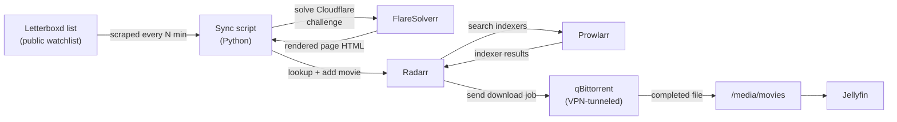
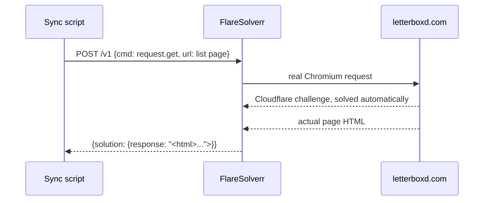
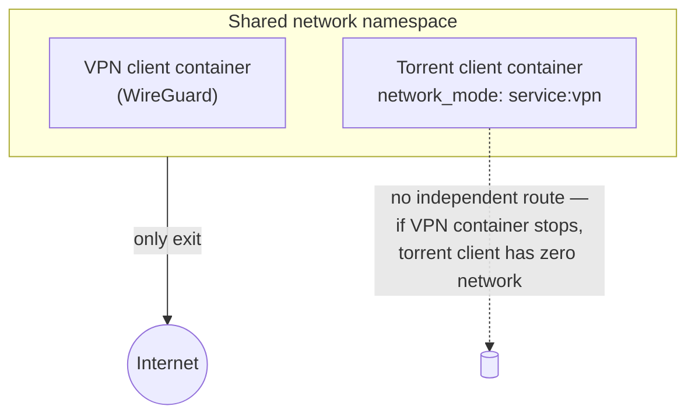

# Homelab Automated Media Pipeline

  
  
  
  
  
  
  

A self-hosted media server built on a single repurposed desktop PC, with a
fully automated pipeline that goes from *"add a movie to a public watchlist"*
to *"it's playable in my media library"* — no manual searching required.

The interesting part isn't the media server itself (Jellyfin + the \*arr
stack is a well-trodden path). It's the **last mile**: turning a public
[Letterboxd](https://letterboxd.com) list into a trigger for the download
pipeline, bypassing the fact that Letterboxd sits behind Cloudflare and
doesn't expose the RSS feed you'd expect.

## What it does

Add a film to the watchlist → within 15 minutes it shows up as "downloading"
in Radarr → once qBittorrent finishes, it's renamed and imported → it's in
Jellyfin, watchable.

## Why this stack, not a SaaS

Everything here runs on hardware I already owned, reachable only over a
private [Tailscale](https://tailscale.com) mesh network — no ports opened to
the public internet, no third-party service holding my media library or
watch history. The one thing that does leave the LAN with a public exit is
the torrent client, and it's tunneled through a commercial VPN with **no
fallback path** if the tunnel drops (see [Network & Security
Architecture](docs/network-architecture.md)).

## Architecture highlights

### Bypassing Cloudflare to read a Letterboxd list

Letterboxd sits behind Cloudflare's bot protection, and its list-level RSS
feed no longer works at all — so the sync script fetches the rendered page
through [FlareSolverr](https://github.com/FlareSolverr/FlareSolverr) (a
headless-Chromium proxy already running in this stack for a Cloudflare-
protected torrent indexer) and scrapes the film titles straight out of the
real HTML markup instead of relying on a feed that doesn't exist anymore.

Full writeup, including the exact markup pattern and why the obvious
guesses (RSS, common poster attributes) didn't pan out: [docs/letterboxd-automation.md](docs/letterboxd-automation.md).

### A VPN boundary that fails closed, not open

Rather than a script that monitors the VPN and kills the torrent client if
it drops — which leaks traffic for however long the monitor takes to
notice — the torrent client container has **no network stack of its own**.
It shares the VPN container's network namespace directly
(`network_mode: service:gluetun`), so if the VPN container stops for any
reason, the torrent client doesn't fall back to the host's real IP — it has
no route to the internet at all.

Full writeup, including what deliberately isn't tunneled and how to verify
it: [docs/network-architecture.md](docs/network-architecture.md).

## Components

| Layer | Tool | Role |
|---|---|---|
| Reverse-mesh access | Tailscale | Private remote access to every service, no port forwarding |
| Egress privacy |  Gluetun + WireGuard | VPN-tunnels only the torrent client, structurally (not a monitored "kill switch") |
| Indexer aggregation | Prowlarr | One indexer config shared by Sonarr/Radarr |
| Acquisition |  Sonarr,  Radarr | TV/movie search, matching, and library management |
| Download |  qBittorrent | Runs inside the VPN tunnel's network namespace |
| Cloudflare bypass | FlareSolverr | Headless-browser proxy for indexers (and, here, for Letterboxd) |
| Subtitles | Bazarr | Automatic subtitle fetching |
| Requests | Jellyseerr | Manual request intake for anyone else with access |
| Playback |  Jellyfin | Media server and client apps |
| Photo library | Immich | Self-hosted photo/video backup with ML-based search and albums |
| **List automation** |  **custom script** (this repo) | Watches a public Letterboxd list, adds new films to Radarr |

## Docs

- [Network & Security Architecture](docs/network-architecture.md) — how the VPN boundary is actually enforced, and what is/isn't tunneled
- [Letterboxd → Radarr Automation](docs/letterboxd-automation.md) — the scraping approach, why RSS doesn't work anymore, and how the Cloudflare challenge is solved
- [Hardware](docs/hardware.md) — the machines this runs on, and what each one is (and isn't) used for
- [`docker-compose.example.yml`](docker-compose.example.yml) — the full stack, with secrets/IPs replaced by placeholders
- [`scripts/letterboxd_radarr_sync.py`](scripts/letterboxd_radarr_sync.py) — the sync script itself

## Setup

1. Stand up the stack from `docker-compose.example.yml` (copy to `compose.yml`, fill in your own VPN credentials, paths, and API keys — never commit the real file)
2. Make your Letterboxd list public (Edit List → "Who can view" → Anyone)
3. Copy `scripts/letterboxd-radarr.conf.example` to `letterboxd-radarr.conf`, fill in your Radarr API key and list URL
4. Run `scripts/letterboxd_radarr_sync.py` on a cron schedule (every 15–30 min)

Full walkthrough in [docs/letterboxd-automation.md](docs/letterboxd-automation.md).

## Disclaimer

This project is documentation of a personal infrastructure build for
legally-owned/self-created media and public-domain content. It does not
condone or facilitate copyright infringement; how you use the underlying
tools (Prowlarr, qBittorrent, etc.) is your own responsibility and subject
to your local laws.
