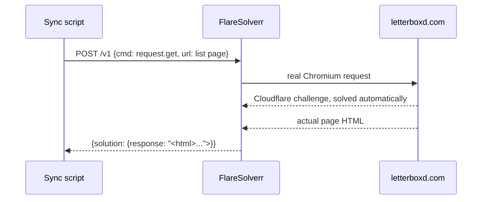

# Letterboxd → Radarr Automation

The goal: add a film to a public Letterboxd list, and have it show up
downloading in Radarr within minutes — no other manual step.

## Why this isn't just "subscribe to the RSS feed"

Every Letterboxd list is supposed to expose an RSS feed at
`https://letterboxd.com/<user>/list/<slug>/rss/`. In practice, this route
now consistently 404s for custom lists (whatever internal changes Letterboxd
has made, the feature seems to have been quietly retired or restricted). The
list's *own page*, though, still renders normally in a browser and is
publicly viewable — so the plan became: fetch the page itself and parse the
films back out of the HTML.

## Problem 1: Cloudflare

A plain `curl` (or any script without a real browser engine) against
`letterboxd.com` gets served a Cloudflare JS challenge page ("Just a
moment...") instead of the real content — the same protection that blocks
naive scraping of plenty of other sites (this homelab already runs into it
on a torrent indexer, handled the same way).

The fix already existed in this stack for that indexer:
[FlareSolverr](https://github.com/FlareSolverr/FlareSolverr), a small
service that runs an actual headless Chromium instance, solves the
challenge, and hands back the resulting page. Reusing it here means no new
infrastructure — just another consumer of a container already running.



## Problem 2: the film list isn't where you'd expect

The obvious guesses for how Letterboxd marks up each poster in a list
(`data-film-name`, `.poster-container`, etc.) don't match current markup at
all — those attributes don't exist on the page as served. What *is* present,
verified directly against the real HTML rather than assumed, is a plain
anchor tag per film:

```html
<a href="/film/the-battery-2012/" class="frame"
   data-original-title="The Battery (2012) ">
  <span class="frame-title">The Battery (2012)</span>
</a>
```

The `data-original-title` attribute conveniently carries both the exact
title and year in one string, which is exactly what Radarr's own lookup API
wants as input. The regex the script uses:

```python
FILM_RE = re.compile(
    r'href="/film/([a-z0-9-]+)/"\s+class="frame"\s+data-original-title="([^"(]+?)\s*\((\d{4})\)\s*"'
)
```

This is brittle in the way all scraping is — if Letterboxd changes this
markup, the regex needs updating. It's worth verifying against a fresh page
fetch (`grep`-ing the actual response) before assuming any particular
attribute name still applies.

## Problem 3: don't re-add films you've already processed

The script keeps a small local JSON file of film slugs it's already seen
(`letterboxd-radarr.seen.json`), so re-running it on a schedule only acts on
genuinely new list entries rather than re-triggering a search every cycle.

## Putting it together

1. POST the list URL to FlareSolverr, get back the rendered page HTML
2. Regex out `(slug, title, year)` for every film on the page
3. Skip slugs already recorded as seen
4. For each new film, call Radarr's `GET /api/v3/movie/lookup?term=<title>`
   to resolve it to a TMDB ID, matching on year to disambiguate remakes
5. `POST /api/v3/movie` to add it — `monitored: true`,
   `addOptions.searchForMovie: true` triggers an immediate indexer search
6. Record the slug as seen

From there it's Radarr's own existing pipeline: indexer search → download
client → import → library.

See [`scripts/letterboxd_radarr_sync.py`](../scripts/letterboxd_radarr_sync.py)
for the full implementation and
[`scripts/letterboxd-radarr.conf.example`](../scripts/letterboxd-radarr.conf.example)
for the config it expects.

## Running it on a schedule

```cron
*/15 * * * * /usr/bin/python3 /path/to/letterboxd_radarr_sync.py >> /path/to/letterboxd-radarr.log 2>&1
```

Every run spins up a real headless browser inside FlareSolverr, which is
heavier than a plain HTTP request — 15–30 minutes is a reasonable interval
for a personal watchlist; there's no need to poll more aggressively than
that.

## Following more than one list

The script reads its settings from a config file, and which file (and which
"already seen" state file) it uses can be overridden per run with environment
variables. Give each list its own pair of files and its own cron line, offset
by a few minutes so the two don't hit FlareSolverr's headless browser at the
same moment:

```cron
*/15 * * * *        /usr/bin/python3 /path/to/letterboxd_radarr_sync.py >> /path/to/list1.log 2>&1
7,22,37,52 * * * *  LB_RADARR_CONF=/path/to/list2.conf LB_RADARR_STATE=/path/to/list2.seen.json /usr/bin/python3 /path/to/letterboxd_radarr_sync.py >> /path/to/list2.log 2>&1
```

Each list keeps its own seen-state, so adding a film to one list never
affects the other's history.
