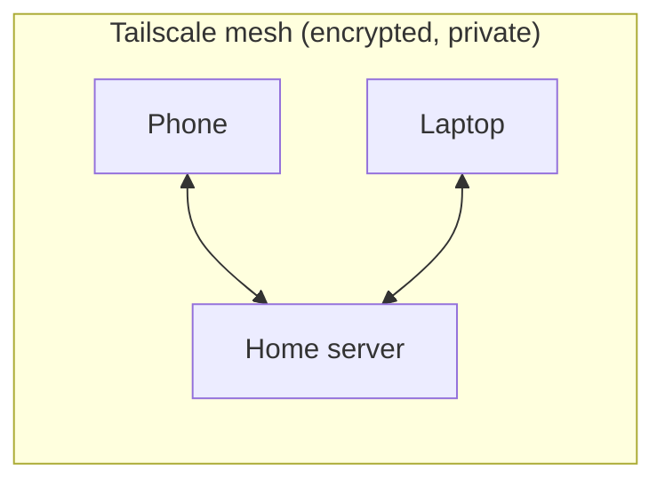
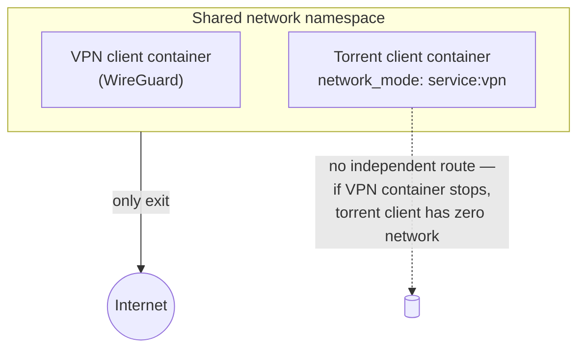

# Network & Security Architecture

## Goals

- Every service reachable remotely, without opening a single port on the home router
- Torrent traffic never touches the home ISP connection's real IP — and this has to hold even if the VPN client crashes, not just "most of the time"
- No reliance on a monitoring process to catch a leak after the fact — the leak should be structurally impossible

## Remote access: Tailscale mesh, not port forwarding

All services sit behind [Tailscale](https://tailscale.com), a WireGuard-based
mesh VPN. Every device that should be able to reach the server — laptop,
phone — is itself a node on the same private tailnet. There's no exposed
port on the home router at all; remote access works the same whether you're
on the home LAN or on the other side of the planet, because the "network"
your devices see is the tailnet, not the internet.



This is a deliberate separation from the *second* VPN below — Tailscale
handles "how do my devices reach my server," and has nothing to do with
"how does my torrent traffic leave the building."

## Egress privacy: a structural tunnel, not a monitored kill switch

A common (and fragile) approach to VPN'd torrenting is: run a VPN client,
then run a script that watches the connection and kills the torrent client
if the VPN drops. This works *until* the monitor itself lags, crashes, or
races the VPN's own reconnect — at which point traffic silently falls back
to the real IP for however long it takes the monitor to notice.

This setup avoids that category of bug entirely by giving the torrent
client **no network path that doesn't go through the VPN container**:



The torrent client container is configured with
`network_mode: "service:<vpn-container>"` — it doesn't get its own network
stack at all. It shares the VPN container's namespace, full stop. If the VPN
container is stopped, killed, or fails to start, the torrent client doesn't
"fall back to the host network" — it has no network at all. There's no
monitor to lag, because there's no separate path to leak through.

Everything else (the \*arr stack, Jellyfin, Prowlarr) runs on the host's
normal network, since only the actual download traffic needs tunneling —
searching an indexer for a movie title isn't privacy-sensitive the same way
the resulting transfer is.

## What's *not* tunneled, on purpose

The indexer-search step (Prowlarr → indexer sites) is not routed through the
VPN. Practically, this only matters for sites that Cloudflare-challenge
scrapers/bots — those get routed through a local Cloudflare-solving proxy
container instead, which is a separate concern from IP privacy (see
[Letterboxd Automation](letterboxd-automation.md) for the same technique
applied to a completely different site).

## Verifying it actually works

Before trusting this setup, it's worth confirming from *inside* the tunneled
container that its public IP differs from the host's:

```bash
docker exec <vpn-container> curl -s ifconfig.me
curl -s ifconfig.me   # run on the host — should differ
```

And confirming the torrent client itself reports the tunnel's IP to peers,
not the host's, using any of the public "torrent IP address checker" tools
that give you a magnet link to test against your own client.
